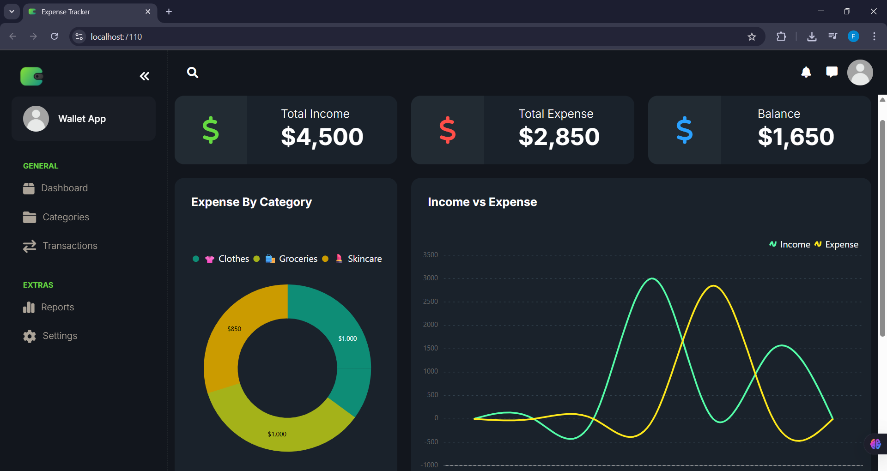
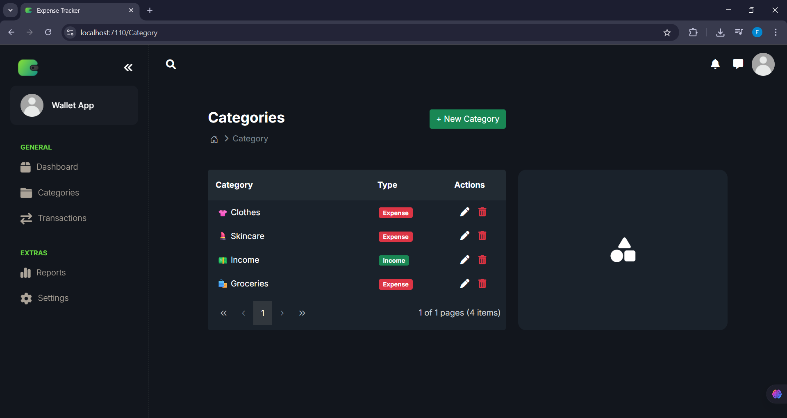
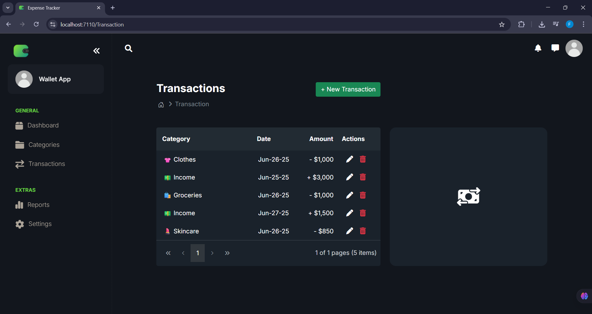

## Overview

A web-based **expense tracker application** enabling users to:
- Add, update, and delete expense transactions
- Categorize expenses for better tracking
- View recent transactions and total balances
- Visualize spending with charts and dashboards

The system is built using **ASP.NET Core MVC** and **Entity Framework Core** with SQL Server for data storage.

---

## Screenshots

### Dashboard


### Categories


### Transactions


---

## Technologies Used

- **ASP.NET Core MVC** — For the application’s backend and server-side logic.
- **Entity Framework Core** — For managing data access and interactions with the database.
- **SQL Server** — For storing application data such as categories and transactions.
- **JavaScript / HTML / CSS** — For the application's frontend.
- **Syncfusion Charts** — For rendering dynamic dashboards.

---

## Setup Instructions

### 1. Clone the repository:
```bash
git clone https://github.com/farahmaged/dotnet-expense-tracker.git
cd dotnet-expense-tracker
```

### 2. Open the project
Open the solution in Visual Studio or your preferred IDE.

### 3. Apply database migrations
Using the Package Manager Console:

```bash
Update-Database
```

Or using the CLI:

```bash
dotnet ef database update
```

### 4. Run the application
```bash
dotnet run
```